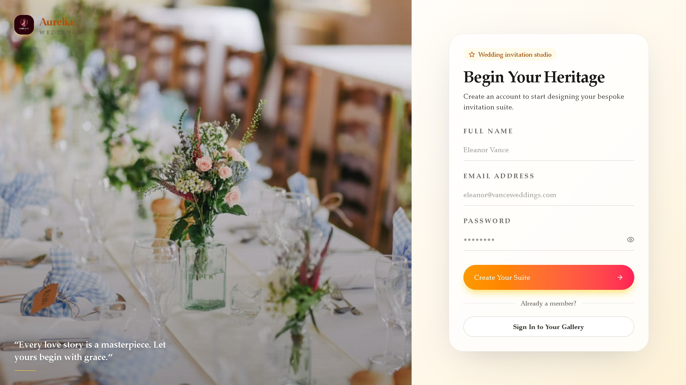
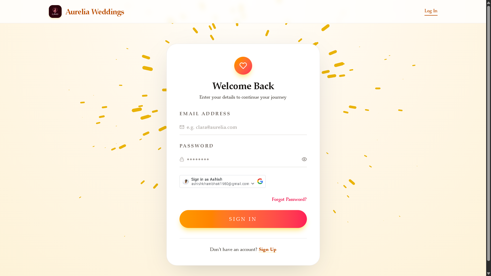
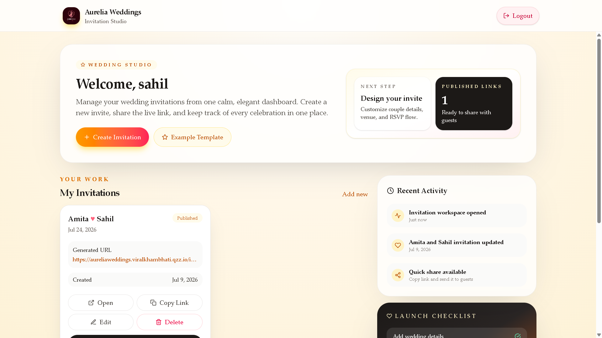
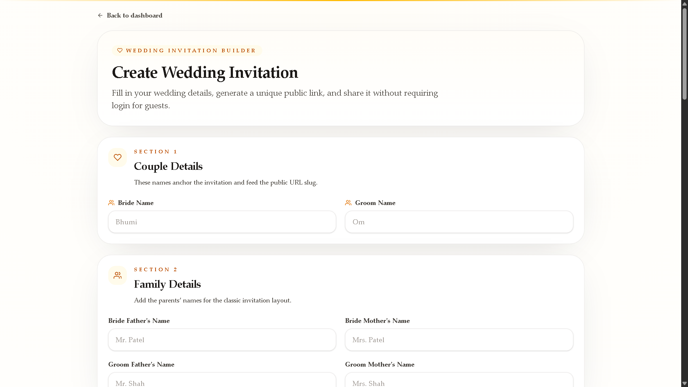
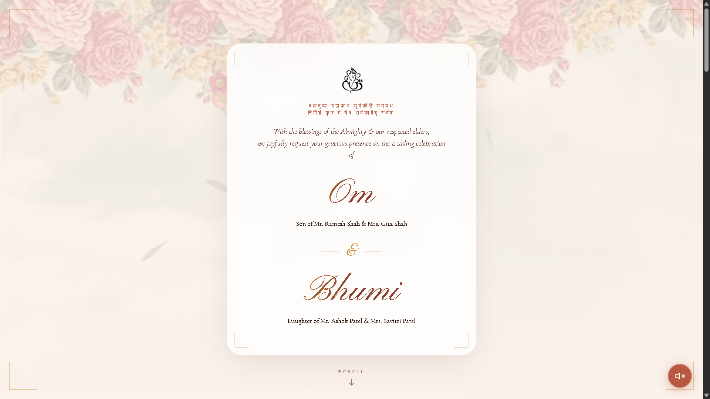

# 💍 Aurelia Weddings — Free Online Wedding Invitation Maker

**Create a beautiful, personalized wedding invitation website in minutes — no coding, no design skills needed.**

[](https://aureliaweddings.viralkhambhati.qzz.io/)

**👉 [Try Aurelia Weddings Now](https://aureliaweddings.viralkhambhati.qzz.io/) — Build your digital wedding invite in under 5 minutes.**

Aurelia Weddings is a modern **digital wedding invitation platform** (Indian wedding e-invite, shaadi invitation website, online wedding card maker) that lets couples create personalized wedding websites, manage multiple wedding events (Mehndi, Haldi, Sangeet, Reception), and share a single beautiful link with every guest — instead of printing and posting cards.

> 🔍 **Also searched as:** online wedding invitation card, digital shaadi card, e-invite website, wedding invitation link generator, free wedding website builder India

---
## 🚀 How It Works

1. **Create an account**
2. **Login** to your dashboard
3. **Fill in** wedding details
4. **Add** wedding events
5. **Generate** your invitation website
6. **Share** your unique link with family and friends

---
## 📸 See It In Action

<table>
  <tr>
    <td align="center"><b>Sign Up</b><br></td>
    <td align="center"><b>Sign In</b><br></td>
  </tr>
  <tr>
    <td align="center"><b>Dashboard</b><br></td>
    <td align="center"><b>Create Invitation</b><br></td>
  </tr>
  <tr>
    <td align="center" colspan="2"><b>Live Invitation Page</b><br></td>
  </tr>
</table>

---

## 🚀 Why Couples Choose Aurelia Weddings

| Traditional Cards | Aurelia Weddings |
|---|---|
| ₹₹₹ printing + courier cost | 100% free & digital |
| Guests lose the card | Permanent shareable link |
| No live venue directions | Built-in Google Maps navigation |
| One-time static info | Editable anytime from dashboard |
| Days to print & distribute | Live in under 5 minutes |

---

## ✨ Features

### 👤 User Authentication
- Secure Signup & Login
- JWT Authentication
- Protected Dashboard
- User-specific Invitation Management

### 💒 Wedding Invitation Builder
- Bride & Groom Information
- Parents Information
- Wedding Date & Time
- Invitation By Details
- Custom Wedding Message
- Cover Images Support

### 🎉 Multi-Event Management
Create multiple wedding events such as:
- Engagement
- Mehndi
- Haldi
- Sangeet
- Wedding Ceremony
- Reception
- Custom Events

Each event supports: Event Name, Date, Time, Venue, and Google Maps Link.

### 🔗 Dynamic Invitation URLs
Every invitation gets a unique, shareable public URL:
```
https://aureliaweddings.viralkhambhati.qzz.io/invite/priya-weds-aarav
```

### 📍 Google Maps Integration
Guests navigate to venues directly from the invitation.

### 📱 Fully Responsive
Optimized for Mobile, Tablet, Laptop, and Desktop.

### ⚡ Performance
Server-side Caching · Lazy Loading · Optimized API Responses · Fast Page Rendering

---

## 🏗 Project Architecture

```text
Frontend (React.js)
        │
        ▼
Axios API Requests
        │
        ▼
Backend (Node.js + Express.js)
        │
        ▼
MongoDB Database
        │
        ▼
Dynamic Invitation Website
```

---

## 🛠 Tech Stack

**Frontend:** React.js · React Router DOM · Axios · CSS3 · React Helmet Async
**Backend:** Node.js · Express.js · JWT Authentication · Express Session
**Database:** MongoDB Atlas · Mongoose
**Deployment:** Vercel · Render

---

## 📂 Core Modules

- **Authentication** — Registration, Login, Authorization, Protected Routes
- **Invitation** — Create, Edit, Delete, Dynamic URL Generation
- **Public** — Invitation Display, Event Presentation, Venue Navigation
- **Dashboard** — Manage Invitations, Generate Public Links

---

## 🔒 Security

JWT Authentication · Protected APIs · Route Authorization · Input Validation · CORS Protection · Rate Limiting

---

## 🎯 Who It's For

- **Couples** — create and share your wedding invite online
- **Event Organizers** — manage every wedding event digitally
- **Families** — send details to guests instantly
- **Guests** — view everything from any device, anytime

---

## 📈 Roadmap / Coming Soon

- [ ] WhatsApp Invitation Sharing (1-click)
- [ ] Email Invitations
- [ ] Wedding Photo Gallery
- [ ] QR Code Invitations
- [ ] Multiple Premium Templates
- [ ] Multi-Language Support (Gujarati, Hindi, English)
- [ ] Custom Themes & Designs

**Have an idea?** [Open an issue](https://github.com/Viralkhambhati/your-repository-name/issues) or submit a feature request — this project grows with community input.

---

## ⚙️ Installation (for developers)

```bash
git clone https://github.com/Viralkhambhati/your-repository-name.git

# Backend
cd backend
npm install

# Frontend
cd frontend
npm install
```

Create a `.env` file inside `backend/`:

```env
PORT=5000
MONGO_URI=your_mongodb_connection_string
JWT_SECRET=your_jwt_secret
CLIENT_URL=http://localhost:5173
```

Run both:

```bash
npm run dev   # inside backend/
npm run dev   # inside frontend/
```

---

## 🤝 Contributing

Contributions, issues, and feature requests are welcome!
1. Fork the repo
2. Create your branch (`git checkout -b feature/amazing-feature`)
3. Commit your changes
4. Push and open a Pull Request

⭐ **If this project helps you, please star the repo** — it directly helps more people discover it on GitHub.

---

## 👨‍💻 Developer

**Viral Khambhati**
Bachelor of Engineering (Computer Engineering)
C.K. Pithawala College of Engineering & Technology, Surat, Gujarat, India

- 🌐 Portfolio: https://viral-khambhati-portfolio-live.vercel.app
- 💻 GitHub: https://github.com/Viralkhambhati
- 🔗 LinkedIn: *(add your LinkedIn link here — great for recruiter & user discovery)*
- 🐦 Twitter/X: *(optional — helps with sharing traction)*

---

## ⭐ Support This Project

If you like Aurelia Weddings:
- Give it a ⭐ on GitHub
- Share the [live demo](https://aureliaweddings.viralkhambhati.qzz.io/) with a couple planning their wedding
- Tag it on social media using **#AureliaWeddings**


Made with ❤️ for modern weddings.
